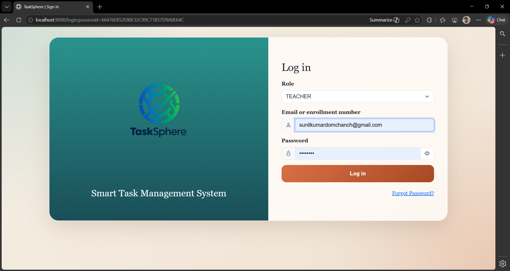
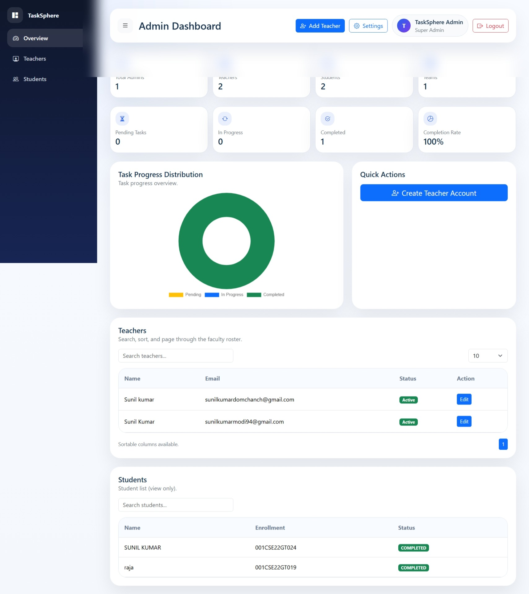
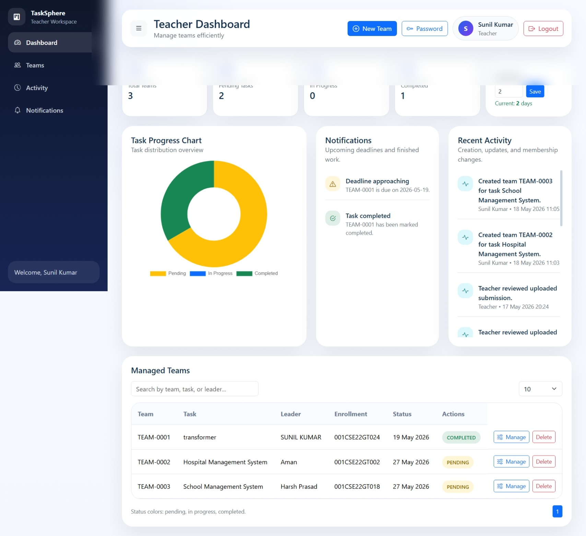
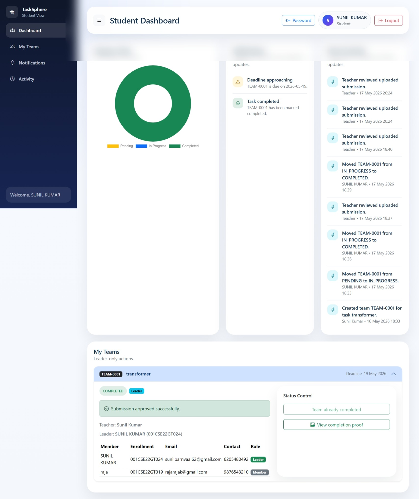

# TaskSphere

TaskSphere is a Smart Academic Team & Task Management System developed for universities and engineering colleges to simplify project coordination, task allocation, deadline tracking, and academic workflow management.

The system provides a centralized platform where teachers can manage project teams, assign tasks, monitor progress, review submissions, and maintain accountability through activity logs and notifications.

---

# Features

- Role-Based Authentication (Super Admin, Teacher, Student)
- Secure Login with BCrypt Password Hashing
- First Login Password Change Enforcement
- Forgot Password & Reset via Email
- Teacher Team Management System
- Team Leader Workflow
- Task Status Tracking
  - Pending
  - In Progress
  - Completed
- Completion Proof Upload System
- Teacher Review & Re-upload Workflow
- Automated Deadline Reminder Emails
- Activity Logging System
- Centralized Notifications
- AJAX-Based Student Validation
- Responsive Dashboard UI

---

# Tech Stack

## Backend
- Java 21
- Spring Boot 3.3.6
- Spring MVC
- JdbcTemplate
- Spring Mail

## Frontend
- Thymeleaf
- HTML5
- CSS3
- Bootstrap 5
- JavaScript

## Database
- MySQL 8

## Tools
- Maven
- IntelliJ IDEA
- Git & GitHub

---

# System Roles

## Super Admin
- Manage teachers and students
- Monitor system-wide statistics
- Control user operations

## Teacher
- Create and manage teams
- Assign project tasks
- Configure deadlines
- Review submissions
- Approve or request re-upload

## Student
- View assigned tasks
- Update task status
- Upload completion proof
- Track notifications and activity

---

# Project Structure

TaskSphere/
│
├── src/
├── screenshots/
├── docx/
├── pom.xml
├── .gitignore
└── README.md

---

# Screenshots

## Login Page


## Super Admin Dashboard


## Teacher Dashboard


## Student Dashboard


---

# Installation & Setup

## 1. Clone Repository

```bash
git clone https://github.com/SunilBarnwal/TaskSphere.git
````

---

## 2. Configure MySQL

Create a database:

```sql
CREATE DATABASE tasksphere_db;
```

Update `application.properties` with your MySQL username and password.

---

## 3. Run Application

```bash
mvn spring-boot:run
```

Application will run on:

```text
http://localhost:9090
```

---

# Security Features

* BCrypt Password Encryption
* Session-Based Authentication
* Role-Based Access Control
* Password Reset Tokens
* Secure File Upload Validation

---

# Future Enhancements

* Mobile Application
* Real-Time Chat System
* LMS Integration
* Multi-Department Support
* Cloud Deployment
* Analytics Dashboard

---

# Academic Project

B.Tech Final Year Project
Department of Computer Science & Engineering
RKDF University, Ranchi

---

# Authors

* Raja Kumar Rajak
* Sunil Kumar

```
```
